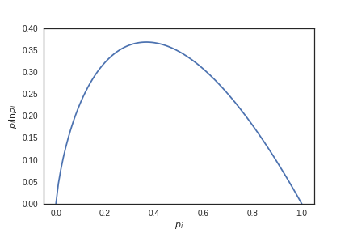

### Review: practice on your own
What is maximum value of entropy that a discrete, $$N$$-state system can have? What is the minimum? That is, if I have a system with $$N$$ possible states and the probabilities associated with each of those states are $$\{p_1, p_2,\ldots, p_N\}$$, what values of $$\{p_i\}$$ yield the largest values of $$S$$? The smallest?

Let's start with the minimum. Plotting the function $$-p\ln p$$  gives the following:

The smallest possible value for entropy is 0. This occurs at $$p_i = 0$$ and $$p_i = 1$$. That means that we could build up a distribution that looks like $$\{p_i\} = \{0, 0, 0, \ldots, 0, 1\}$$ and the entropy of that distribution would be zero.

The only reason that sort of intuition worked is because we got lucky: the two values $$p_i = 0$$ and $$p_i = 1$$ can easily be combined to obtain a *normalized* distribution. You *couldn't*, however, just "eyeball" the maximum value of entropy here. Why? Because the maximum of the curve occurs at $$p_i = 0.3$$-ish, and you couldn't just make a distribution $$\{p_i\} = \{0.3, 0.3, 0.3, \ldots, 0.3\}$$. It's not normalized!

So we have to get at the max through Lagrange multipliers.

$$\mathcal{L} = -\sum_i^N p_i \ln p_i - \lambda \left(\sum_i^N p_i - 1\right)$$

Taking partials, we find

$$p_i = e^{-\lambda-1}.$$

That means every single $$p_i$$ is equal to the same constant!

$$\sum_i^N p_i = 1\Rightarrow p_i = \frac{1}{N}.$$

The maximum entropy distribution (*with no constraints!!*) is a uniform distribution. On the other hand, we found that the maxEnt distribution for known mean and variance was the normal distribution.

---

### Maximizing multiplicities subject to constraints

In physical systems, we often only know about ensemble average quantities (i.e., thermodynamic variables) rather than details of the particular microstates $$\mu$$.

This is analagous to rolling a die and *only* knowing the average value of the rolls, rather than the values of each individual roll.

So anyway, if we only know the average values of a probability distribution, but not the distribution itself, what underlying probability distribution should we assume? If we only know the average energy of a system, what probability distribution should we assign to the energy?

$$p(\epsilon(\mu) = E) = ??$$

Well, we know that systems in equilibrium are in states of **maximumum multiplicity,** and we found last lecture that maximizing multiplicity corresponds to maximizing entropy. So we have to solve the following constrained optimization problem:

1. $$\max S$$ where $$ S = -\int p(\epsilon(\mu)) \ln p(\epsilon(\mu))d\mu$$.
2. $$\int \epsilon(\mu)p(\epsilon(\mu))d \mu = E$$

Plug and chug with Lagrange multipliers:

$$\mathcal{L} = -\int p\ln p d\mu- \lambda \left(\int p d\mu - 1\right) - \beta \left(\int \epsilon pd\mu - E\right)$$

$$p(\epsilon) = \frac{e^{-\beta \epsilon}}{\int_{\Omega} e^{-\beta \epsilon(\mu)}d\mu}$$

### Partition functions: the most important thing in statistical mechaincs

The denominator (normalization factor) above is called the "partition function".

$$ Z = \int_{\Omega} e^{-\beta \epsilon(\mu)}d\mu$$

It gets its own name because it's so critically important.

We'll find, as we dive into thermodynamics, that it's really messy and challenging to relate multiple thermodynamic variables to one another. The partition function is amazing and almost magical in the that you can use *just* that quantity to get basically all the thermodynamic variables you could possibly want. That may seem opaque now, which is ok. We have to do thermodynamics before it "clicks".

---

**Example: Four bead polymer*.* Suppose we have a four bead polymer that can be in one of four five conformations. One conformation is a "closed" state with energy $$\epsilon_0 = 0$$, and the other four are "open states" with each having energy $$\epsilon_1 = \epsilon$$. Let's find the probabilities of being in the open or closed state at high and low temperatures.

We can write down the partition function immediately:

$$Z = \sum_{\{\mu\}} e^{-\beta \epsilon(\mu)} = e^{-\beta \epsilon_0} + 4e^{-\beta\epsilon_1} = 1 + 4e^{-\beta \epsilon}.$$

The probabilities are simply the Boltzmann factors divided by their normalization (the partition function!)

$$p_{\text{open}} = \frac{1}{1+4e^{-\beta\epsilon}}~~~~~ p_{\text{closed}} = \frac{4e^{-\beta\epsilon}}{1+4e^{-\beta\epsilon}}$$

Let's take the low temperature limit $$T\rightarrow0, \beta\rightarrow\infty$$:

$$\lim_{T\rightarrow 0}p_{\text{open}} = \frac{1}{1+\text{tiny number}}=1$$

$$\lim_{T\rightarrow 0}p_{\text{closed}} = \frac{\text{tiny number}}{1+\text{tiny number}}=0$$

At low temperatures, **energy effects dominate.** We favor the ground state of the system.

Now the high temperature limit$$T\rightarrow\infty, \beta\rightarrow 0$$:

$$\lim_{T\rightarrow \infty}p_{\text{open}} = \frac{1}{1+4}=\frac{1}{5}$$

$$\lim_{T\rightarrow 0}p_{\text{closed}} = \frac{4}{1+4}=\frac{4}{5}$$

At low temperatures, **entropic effects dominate.** We favor the most uniform distribution of states!

---

## Practice on your own
Get started on the homework!
