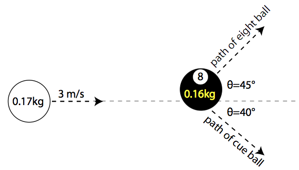
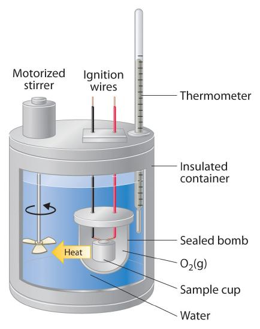

### Definitions

**equilibrium:** system whose properties do not change appreciably over time. Depends on the timescale of interest! Glass is in equilibrium over the scale of our lifetimes, but flows like a fluid over millenia

**closed system:** a system which is completely isolated from its surroundings by adiabatic walls

**open system:** a system which can exchange heat with it's surroundings

**quasistatic process**: a thermodynamic transformation which is performed slowly enough so that the system is always in equilibrium.

### First law of thermodynamics

You may read different formulations of the first law, but they can all be derived from each other. I will simply use:

"Energy is conserved"

There are really three ways to change the energy of a system. We can

1. do mechanical work (pressure/volume work)
2. attach the system to a heat bath (temperature/entropy "work")
3. allow the system to undergo a chemical reaction

We did not intially discuss \#3 in class. In fact, I had originally written the first law in class as "the work required to change the state of a closed sytem is path independent." That most directly corresponds to \#1. Again, there are multiple different formulations, and choosing the most intuitive one can be a challenge.

I'm going to abandon my original approach and just write the first law as

$$dU = đW + đQ + \mu dN$$

This tells us that the total internal energy of the system is the sum of: work done on the system; heat added to the system; chemical energy from adding partiticles to the system. Notice that work and heat are inexact differentials: they depend on the path taken, or **how** work is done and **how** heat is added. (constant pressure process? Constant volume?)

Let's consider the first two ways of adding energy.

#### Mechanical Work and Heat Exchange
If we have a quasistatic process, then we can write the work easily in terms of generalized coordinates:

$$ đW = \sum_i J_i dx_i $$

We refer to $$J_i$$ as a "generalized force" and $$x_i$$ as a generalized displacement. Probably the most familiar set of generalized coordinates are pressure and volume. $$V$$ is a kind of 3D displacement and $$P$$ is a kind of 3D force.

Here is a table of the generalized pairs that you may encounter and what systems they correspond to:

| System             | Force              | Displacement          |
|--------------------|--------------------|-----------------------|
| wire/polymer       | tension $$F$$          | length $$L$$              |
| film/surfactant    | surface tension $$\sigma$$  | area $$A$$                |
| gas                | $$-P$$                 | $$V$$                     |
| dielectic/membrane | electric field $$E$$   | polarization $$P$$        |
| chemical reaction  | chemical potential $$\mu$$ | number of particles $$N$$ |
| heat bath          | temperature $$T$$      | entropy $$S$$             |

You might be a bit confused about $$T,S$$ being shown as a generalized pair! We will see that, at least for reversible processes, we can write $$đQ = TdS$$.

Which brings us to:

#### Reversible Processes
These are a subset of quasistatic processes. They are processes which can be run backwards in time by reversing the "inputs and outputs." Let's turn to a classical system from your freshman physics courses for a clearer understanding of what that means.

You all probably recall (or not? :grin:) problems from your freshman physics courses about playing billiards.

The arrows here show the momenta of the eight ball and cue ball (you can find the final velocities of the billiards using conservation of momenta and energy).

If you reverse the directions of the arrows above, you've got **an equally valid physical process** - energy and momenta are still conserved! Provided, of course, that there's no friction. To be super hand-wavy, but hopefully intuitive:

 **Reversible processes are the frictionless billiards of thermodynamics** 

Thus, if you have a reversible process, you can rewrite the first law as

$$dU = \sum_i J_i dx_i + TdS + \mu dN $$

This is the formulation that will allow us to build up other thermodynamic potentials from first principles. But first, I should make one more point about the first law.

#### Response functions.

Broadly speaking, response functions are "something you can measure experimentally". They are changes in thermodynamic variables that you can measure with probes. You need to know about these functions not because they're inherently fundamental, but because they point you to other fundametal quantities which you **can't** measure.

The most widely discussed response function is probably heat capacity. It's defined as the change in temperature upon addition of heat to a system, or

$$C_X = \frac{\Delta Q}{\Delta T}\bigg)_{X}.$$

where $$X$$ denotes the thermodynamic variable held constant during your measurements.

Calorimeters are the experimental devices used to measure heat capacities.

You can generate a measurable quantity of heat from an electical current or from a chemical reaction (burning 02, shown above). You can also measure the change in temperature as a result of the heat input.

Taking a more theoretical perspective, let's write down the constant volume and constant pressure heat capactities for a system on which we do only P/V work:

$$C_V = \frac{dU + đW}{dT}\bigg)_V = \frac{\partial U}{\partial T}\bigg)_V - P \frac{\partial V}{\partial T}\bigg)_V = \frac{\partial U}{\partial T}\bigg)_V$$

$$C_P = \frac{dU + đW}{dT}\bigg)_P = \frac{\partial U}{\partial T}\bigg)_P - P \frac{\partial V}{\partial T}\bigg)_P$$

These two heat capacities need not be the same!

### The Second Law

There are really three ways to formulate the second law:

1. An isolated system tends toward maximum entropy
2. No process is possible whose sole result is to completely convert heat into work (there are no perfect engines)
3. No process is possible whose sole result is to transfer heat from a colder body to a hotter body.

We spent quite a bit of time in [Lecture 3](Lecture3.md) showing \#1 from a statistical perspective. Now we will take the view of \#3. This will allow us to derive an alternate definition of entropy:

$$\Delta S = S_B - S_A = \int_A^B \frac{đQ_{rev}}{T}$$.

To do this, we'll develop the idea of a Carnot engine.

#### Carnot engine

This is a reversible, cyclic thermodynamic process which occurs in four steps.

A. Heat $$Q_H$$ comes into the system at constant $$T=T_H$$.
B. Adiabatically lower the temperature to $$T = T_C$$
C. Expel $$Q_C$$ into the low temperature reservoir at $$T_C$$
D. Adiabatically raise the temperature to $$T=T_H$$.

Conservation of energy tells us that over the whole cycle, $$\Delta U = 0$$. Thus,

$$W = Q_H - Q_C.$$

We can define something called the "efficiency" of the engine as

$$\eta = \frac{W}{Q_H}$$

this describes the amount of work that one can extract from heat $$Q_H$$ using a Carnot engine. It is possible to show that

$$\eta = 1-\frac{T_C}{T_H}.$$

Combining these two definitions of $$\eta$$,

$$1 - \frac{T_C}{T_H} = \frac{W}{Q_H} = 1 - \frac{Q_C}{Q_H}$$

$$\frac{Q_C}{T_C} = \frac{Q_H}{T_H}$$

We can rearrange these expressions and write them as integrals:

$$\int_A\frac{đQ}{T_H} + \int_C\frac{đQ}{T_C} = 0$$

where now $$đQ$$ indicates an infinitessimal quantity of heat *entering* the engine. Finally, we can add zero to the above expression in a very clever way!

$$\int_A\frac{đQ}{T_H} + \int_B\frac{đQ}{T} + \int_C\frac{đQ}{T_C} + \int_D\frac{đQ}{T} = 0$$

We can add the adiabatic paths in this fashion because, by definition, $$\int_{adiabat}\frac{đQ}{T}=0$$

This proves that the integral of this quantity $$\frac{đQ}{T}$$ over a closed, reversible cycle is always zero!

$$\oint \frac{đQ_{rev}}{T} = 0$$

That means that $$\frac{đQ_{rev}}{T}$$ is *path independent*. Proof:

$$\oint \frac{đQ_{rev}}{T} = \int_A^B \frac{đQ^{(1)}_{rev}}{T} + \int_B^A \frac{đQ^{(2)}_{rev}}{T} = 0$$

Here, the superscripts $$(1), (2)$$ indicate that we're taking two distinct paths from A to B and then B to A.

$$\int_A^B \frac{đQ^{(1)}_{rev}}{T} = \int_B^A \frac{đQ^{(2)}_{rev}}{T}.$$

When we have a differential that is path independent, we can define a state function such that

$$S_B - S_A = \int_A^B \frac{đQ_{rev}}{T}$$

which is what we had set out to prove.
